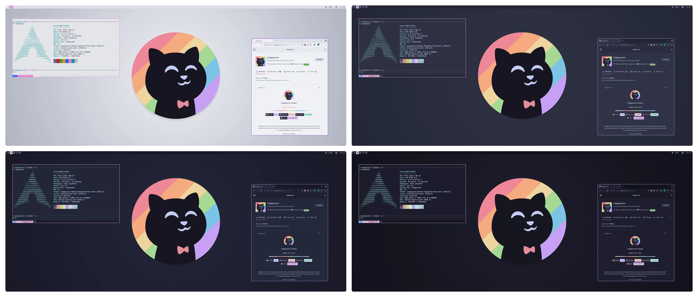
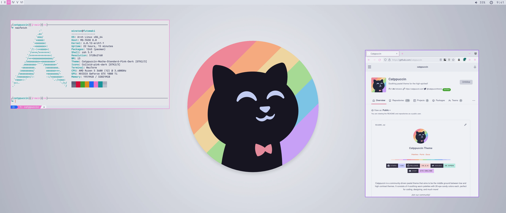
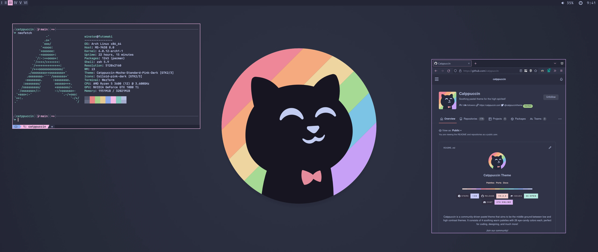
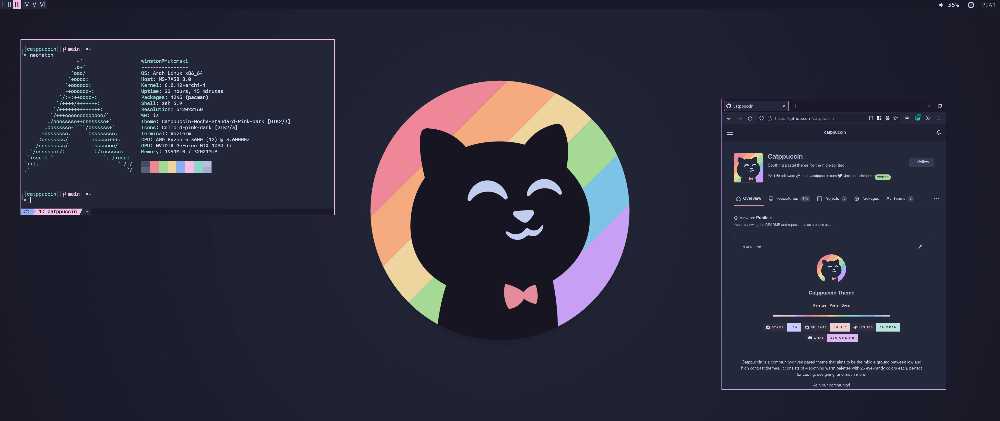
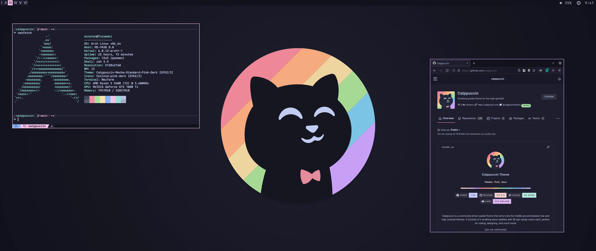

<h3 align="center">
	<br/>
	
	Catppuccin for  <a href="https://github.com/i3/i3">i3</a> & <a href="https://github.com/swaywm/sway">sway</a>
	
</h3>

<p align="center">
	<a href="https://github.com/catppuccin/i3/stargazers"></a>
	<a href="https://github.com/catppuccin/i3/issues"></a>
	<a href="https://github.com/catppuccin/i3/contributors"></a>
</p>

<p align="center">



</p>

## Previews

<details>
<summary>🌻 Latte</summary>



</details>
<details>
<summary>🪴 Frappé</summary>



</details>
<details>
<summary>🌺 Macchiato</summary>



</details>
<details>
<summary>🌿 Mocha</summary>



</details>

## Usage

1. Download the file with your desired flavour e.g. `catppuccin-mocha` (to be
   found in the release or after cloning the repository in themes/)
2. Copy it into your i3 or sway config directory (usually `~/.config/i3/` or
   `~/.config/sway/`)
3. Follow the instructions for your WM
4. When editing the config, use the
   [name of the colour](https://github.com/catppuccin/catppuccin#-palettes) such
   as `$base`.

```i3config
# target                 title     bg    text   indicator  border
client.focused           $pink     $base $text  $rosewater $pink
client.focused_inactive  $mauve    $base $text  $rosewater $mauve
client.unfocused         $mauve    $base $text  $rosewater $mauve
client.urgent            $peach    $base $peach $overlay0  $peach
client.placeholder       $overlay0 $base $text  $overlay0  $overlay0
client.background        $base
```

## Sway
- Include the file at the top of your `config`:
```i3config
include catppuccin-mocha
```

## i3
- Due to a limitation in i3, you cannot use variables from imported files in the top-level config.
- As a workaround, you may create another file to set the colors by importing them, and import in `config`.

## 🙋 FAQ (optional)

- Q: **_"Sway/i3 doesn't work with the colors"_**
  \
  A: Make sure you included the file in the right place and you are using
  `$color`

## 💝 Thanks to

- [rubyowo](https://github.com/rubyowo)

&nbsp;

<p align="center">
	
</p>

<p align="center">
	Copyright &copy; 2021-present <a href="https://github.com/catppuccin" target="_blank">Catppuccin Org</a>
</p>

<p align="center">
	<a href="https://github.com/catppuccin/catppuccin/blob/main/LICENSE"></a>
</p>
